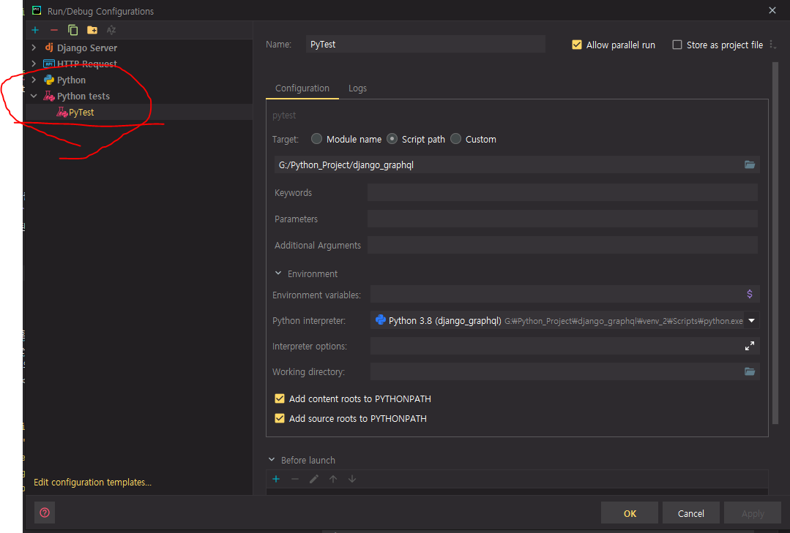

## pytest
> The pytest framework makes it easy to write small, readable tests, and can scale to support complex functional testing for applications and libraries.

* 업계 사용 비율 (stackshare)


## Pros and Cons
### Pros
* 간단하다면 간단하고 쉬운 코드 작성
* fixture를 통한 단위, 인수 테스트 관리
* Test 실행시마다 Database DDL이 관련 SQL이 실행 될 필요가 없음
  * 고정값으로 Master 데이터들은 미리 생성 해놓고 테스트도 가능
* pytest 기반의 수많은 오픈 소스

### Cons
* Django TestCase, APITestCase에 비해 기본 사용을 위한 학습 필요
* 적절한 오픈 소스를 선택하기 위한 시간 소모 
* 테스트 관련 오픈 소스들 마다 추가적인 학습 필요

### 기반 오픈소스 
* pytest-django
  * `pytest`를 기반을 한 Django 테스트 
* pytest-xdist
  * Multi-process Test 실행 
* pytest-benchmark
  * 벤치마크 프로파일링 기능
  * memory_profile 같이 사용 가능
* 

## Install and Settings
### 1. Install Package
```python
pip install pytest pytest-django
```

### 2. Create test config file `pytest.ini`
* pytest 설정 파일
```python
[pytest]
DJANGO_SETTINGS_MODULE = django_graphql.settings_test_only
...
```

### 3. Create `conftest.py`
* 테스트에서 사용할 `fixtures` 선언 해놓은 코드
* `client, database, redis, token, variable` 등등등등 여러가지 다양하게 선언 가능

```python
from graphene.test import Client

@pytest.fixture(scope='function')
def client() -> Generator[Client, Any, None]:
    """
    GraphQL Test Client
    :return: Client
    :rtype: Client
    """
    from django_graphql.schema import schema
    yield Client(schema)

  @pytest.fixture(scope='function')
def api_client() -> Generator[APIClient, Any, None]:
    """
    DRF API Client
    :return APIClient
    :rtype APIClient
    """
    yield APIClient()


@pytest.fixture
def test_db() -> Generator[Session, Any, None]:
    connection = engine.connect()
    transaction = connection.begin()
    session = testingSessionLocal(bind=connection)
    try:
        yield session
    finally:
        transaction.rollback()
        connection.close()

@pytest.fixture
def test_redis() -> Generator[Redis, Any, None]:
    redis = fakeredis.FakeStrictRedis(server=fakeredis.FakeServer())
    try:
        yield redis
    finally:
        redis.close()

@pytest.fixture
def access_token_headers(
        client: TestClient, 
        test_db: Session
) -> dict:
    return get_access_token_for_normal_user(
      client, test_db, e.test_user_email, e.test_user_password
    )


@pytest.fixture
def access_token_headers_admin(
        client: TestClient, 
        test_db: Session
) -> dict:
    return get_access_token_for_admin_user(
      client, test_db, e.test_user_email, e.test_user_password
    )
```


## Run Pytest 
* `pytest .`, `pytest`: 현재 폴더 이하 테스트
* `pytest app/authentication` `pytest app/authentication/tests/test_users.py` : 특정 폴더, 특정 파일 테스트   
* `pytest app/authentication/tests/test_users.py -k test_something` : 특정 파일내 특정 함수 테스트
* 
* `pytest --fixtures` : 적용된 fixture list print
* `pytest -s` : 
* `pytest --benchmark-only` : benchmark test



* 기타 옵션 참고 
  * https://docs.pytest.org/en/latest/reference/reference.html#configuration-options


### Pytest Decorators
* `scope` 설정 : fixture가 실행되는 범위에 대해 정의합니다.  
  설정한 scope 단위로 fixture는 한 번만 생성되고 계속 재사용됩니다.
* 총 5개의 scope이 있으며, 범위의 크기는 아래와 같습니다.   
  function(default) < class < module < package < session

```python
@pytest.fixture(scope="function") : fixture가 함수 단위로 1회 생성됨(디폴트 설정으로, @pytest.fixture 와 같습니다.)
@pytest.fixture(scope="class") : fixture가 클래스 단위로 1회 생성됨
@pytest.fixture(scope="module") : fixture가 파일 단위로 1회 생성됨
@pytest.fixture(scope="package") : fixture가 패키지 단위로 1회 생성됨
@pytest.fixture(scope="session") : fixture가 test session동안 1회 생성됨
```


* `skip` : Skip 기능 
```python
@pytest.mark.skip(reason="Only local test")

@pytest.mark.skipif(
    os.environ.get("SKIP") != "1", 
    reason="It only works if SKIP is set to '1'"
)
```

* `xfail` : 


### `pytest.ini` options
```shell
; true, keep
django_debug_mode = true

; --reuse-db : 재사용 --create-db : 생성
addopts = --reuse-db 
```


### Ref
* pytest
  * 
* pytest-django
  * https://pytest-django.readthedocs.io/en/latest/index.html
  * https://github.com/pytest-dev/pytest-django
* 관련 
  * 