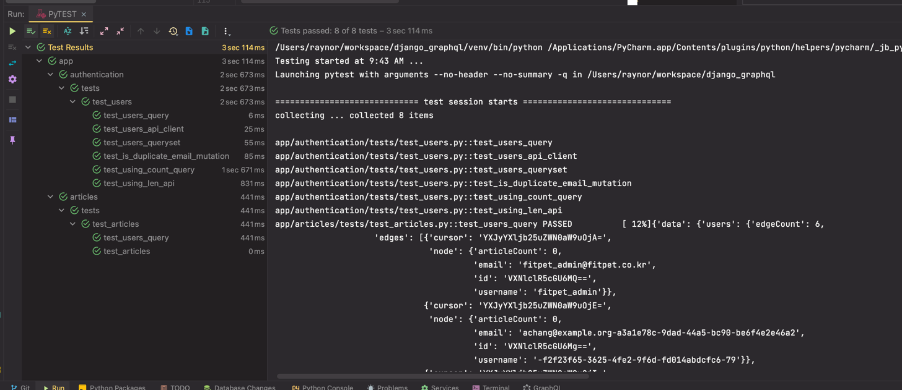
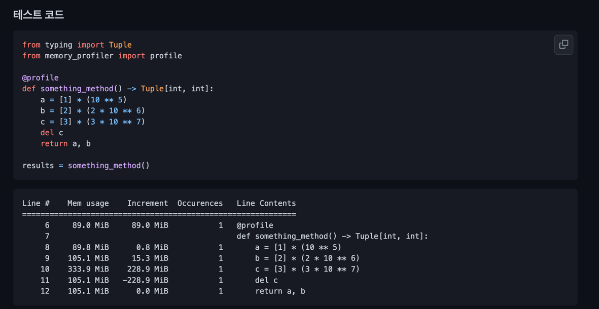

## UnitTest에서 PyTest으로 변경
Python 개발자들은 테스트를 진행하기 위해서 `unittest` 혹은 `pytest`를 사용 한다.

프로젝트를 처음 개발할 때와 간단한 테스트는 `unittest`만으로도 충분했지만   
이후 시간이 지나 Test코드 작성을 위해 Test와 상관 없는 코드를 또 작성하고 또 작성하고 반복 하고
Database DDL 또한 반복 실행되어 괜한 시간을 소요한다.

`pytest`는 위에서 겪은 문제들에 대해서 해결을 할 수 있다.

> The pytest framework makes it easy to write small, readable tests, 
> and can scale to support complex functional testing for applications and libraries.

* stack share


## UnitTest의 문제점
1. 무조건적인 `클래스 기반의 테스트`
2. `전체 테스트`나 `함수 하나의 테스트`나 **전부 Database 재생성이 필요**


## Pros and Cons
### Pros
* 간단하며 쉽게 코드 작성
* `fixture`를 통한 단위, 인수 테스트 관리
* Test 실행시마다 Database `DDL SQL이 재실행 될 필요가 없음`
  * **미리 생성된 데이터 베이스 사용 가능** 
  * 고정값으로 **Master 데이터들은 미리 테이블 값으로 생성** 해놓고 테스트도 가능
* pytest 기반 수많은 오픈 소스

### Cons
* `unittest`에 비해 기본 사용을 위한 `학습시간 필요`
  * 기존 Python 문법과는 다소 생소한 부분이 있음
* 적절한 `pytest` 기반의 오픈 소스를 선택하기 위한 `시간 소모` 
* `fixture`에 대해서 개발자들이 `전부 이해하고 숙지`하고 있어야 함
  * `override 되는 부분` 혹은 `이미 생성된 fixture`가 있을 수 있음
* pytest 관련 오픈 소스 추가할 때마다 `추가적인 학습과 선택을 위한 시간 필요`


### 기반 오픈소스  
* `pytest-django`
  * `pytest`를 기반을 한 Django 테스트 
* `pytest-xdist`
  * Multi-process Test 실행 
* `pytest-benchmark`
  * 벤치마크 프로파일링 기능
  * `memory_profile` 같이 사용 가능
* `pytest-html`
  * 결과 html 생성 (`coverage`랑 같이 사용하면 좋을듯?)
* 등등 ...


### Pytest Decorators
* `scope` 설정 : `fixture`가 실행되는 범위에 대해 정의합니다.  
  설정한 `scope` 단위로 `fixture`는 한 번만 생성되고 계속 재사용됩니다.
* 총 5개의 `scope이` 있으며, 범위의 크기는 아래와 같습니다.   
  `function(default) < class < module < package < session`

```python
@pytest.fixture(scope="function") : fixture가 함수 단위로 1회 생성됨(디폴트 설정으로, @pytest.fixture 와 같습니다.)
@pytest.fixture(scope="class") : fixture가 클래스 단위로 1회 생성됨
@pytest.fixture(scope="module") : fixture가 파일 단위로 1회 생성됨
@pytest.fixture(scope="package") : fixture가 패키지 단위로 1회 생성됨
@pytest.fixture(scope="session") : fixture가 test session동안 1회 생성됨
```


* `skip` : Skip 기능 
```python
@pytest.mark.skip(reason="Only local test")
def test_something():
  pass

@pytest.mark.skipif(
    os.environ.get("SKIP") != "1", 
    reason="It only works if SKIP is set to '1'"
)
def test_something_when_skip():
  pass
```


### `pytest.ini` options
* 기타 옵션 참고 
  * https://docs.pytest.org/en/latest/reference/reference.html#configuration-options
  * https://pytest-django.readthedocs.io/en/latest/configuring_django.html
```shell
; true, keep
django_debug_mode = true

; --reuse-db : 재사용 --create-db : 생성
addopts = --reuse-db 
```


## Install and Settings
### 1. Install Package
```python
pip install pytest pytest-django
```

### 프로젝트 처음 세팅에 해줘야 할 것 
```shell
# 테스트로 사용할 setting 
python manage.py migrate --settings=django_graphql.settings_test_only
```

### 2. Create test config file `pytest.ini`
* pytest 설정 파일
```python
[pytest]
DJANGO_SETTINGS_MODULE = django_graphql.settings_test_only
...

```

### 3. Create `conftest.py`
* 테스트에서 사용할 `fixtures` 선언 해놓은 코드
* `client, database, redis, token, data 생성` 등등등등 여러가지 다양하게 선언 가능

```python
@pytest.fixture(scope='function')
def query_client() -> Generator[Client, Any, None]:
    """
    GraphQL Test Client
    :return: Client
    :rtype: Client
    """
    from django_graphql.schema import schema
    yield Client(schema)

@pytest.fixture
def gql_query(client):
    def func(*args, **kwargs):
        return graphql_query(*args, **kwargs, client=client)

    return func

@pytest.fixture(scope='function')
def api_client() -> Generator[APIClient, Any, None]:
    """
    DRF API Client
    :return APIClient
    :rtype APIClient
    """
    yield APIClient()
    
@pytest.fixture
def access_token_headers(
        client: TestClient, 
        test_db: Session
) -> dict:
    return get_access_token_for_normal_user(
      client, test_db, e.test_user_email, e.test_user_password
    )
```


## Run Pytest



* `pytest .`, `pytest`: 현재 폴더 이하 테스트
* `pytest app/authentication` `pytest app/authentication/tests/test_users.py` : 특정 폴더, 특정 파일 테스트   
* `pytest app/authentication/tests/test_users.py -k test_something` : 특정 파일내 특정 함수 테스트
* `pytest -s` : Capture 표준 출력  
* `pytest --fixtures` : 적용된 fixture list print

* `pytest --benchmark-only` : benchmark test


## 기타 Memory Profile

```shell
Line #    Mem usage    Increment  Occurrences   Line Contents
=============================================================
   122     82.8 MiB     82.8 MiB           1   @profile
   123                                         def something_calc_func():
   124     90.4 MiB      7.6 MiB           1       a = [1] * (10 ** 6)
   125    243.0 MiB    152.6 MiB           1       b = [2] * (2 * 10 ** 7)
   126    243.0 MiB      0.0 MiB           1       del b
   127    243.0 MiB      0.0 MiB           1       return a
```

# Ref
* Official Docs
  * https://docs.pytest.org/en/7.1.x/
  * https://pytest-django.readthedocs.io/en/latest/
* Awesome pytest plugins...
  * https://opensource.com/article/18/6/pytest-plugins
  * https://miguendes.me/7-pytest-plugins-you-must-definitely-use
  * https://towardsdatascience.com/pytest-plugins-to-love-%EF%B8%8F-9c71635fbe22
  * https://betterprogramming.pub/7-pytest-features-and-plugins-that-will-save-you-tons-of-time-74808b9d4756