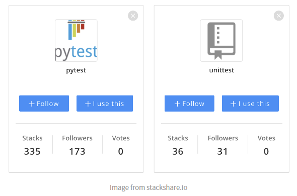

# PyTest
Python 개발자들은 테스트를 진행하기 위해서 `unittest` 혹은 `pytest`를 가장 많이 사용 한다.
`unittest`는 기본 모듈로 이미 같이 설치되고 `pytest`는 개별 설치가 필요하다.

프로젝트를 처음 개발할 때 혹은 간단한 테스트 진행을 할 때는 `unittest`로도 충분했지만   
이후 시간이 지나 Test 작성을 위해 Test와 상관 없는 코드를 또 작성하고 또 작성하고 반복 하고
또한 Database DDL 반복 실행되어 괜한 시간을 소요한다.

`pytest`는 위에서 겪은 문제들에 대해서 해결을 할 수 있다.
> The pytest framework makes it easy to write small, readable tests, 
> and can scale to support complex functional testing for applications and libraries.

### Stack Share
StackShare에서 확인해보면 `unittest` 보다는 `pytest`를 업계에서 더 선호하고 있다. 



## UnitTest의 문제점
1. 무조건적인 `클래스 기반의 테스트`
2. `전체 테스트`나 `함수 하나의 테스트`나 **전부 Database 재생성이 필요**
3. 테스트 케이스가 늘어남에 따라서 중복 소스가 많아 지고 관리가 어려운 부분이 생김,   
내가 개발을 위해서 테스트 코드를 작성하는지 테스트를 할려고 개발을 하는지...


## 장점과 단점
### 장점
* 간단하며 쉽게 코드 작성
* `fixture`를 통한 기능 단위, 인수 관리 용이
* Test 실행시마다 Database `DDL SQL이 재실행 될 필요가 없음`
  * **미리 생성된 데이터 베이스 사용 가능** 
  * 팀에서 명시적 고정값으로 **Master 데이터들은 미리 테이블 값으로 생성** 해놓고 테스트도 가능
* pytest 기반의 많은 오픈 소스

### 단점
* `unittest`에 비해 기본 사용을 위한 `학습시간 필요`
  * 기존 Python 문법과는 다소 생소한 부분이 있음
* 적절한 `pytest` 기반의 오픈 소스를 선택하기 위한 `시간 소모` 
* `fixture`에 대해서 개발자들이 `전부 이해하고 숙지`하고 있어야 함
  * `override 되는 부분` 혹은 `이미 생성된 fixture`가 있을 수 있음
* pytest 관련 오픈 소스 추가할 때마다 `추가적인 학습과 선택을 위한 시간 필요`


### Pytest 기반 오픈 소스  
* `pytest-django`
  * `pytest`를 기반을 한 Django 테스트 
* `pytest-xdist`
  * Multi-process Test 실행 
* `pytest-benchmark`
  * 벤치마크 프로파일링 기능
  * `memory_profile` 같이 사용 가능
* `pytest-html`
  * 결과 html 생성 (`coverage`랑 같이 사용하면 좋을듯?)
* 등등 ...


### Pytest Fixture Decorator
* `scope` 설정 : `fixture`가 실행되는 범위에 대해 정의합니다.  
  설정한 `scope` 단위로 `fixture`는 한 번만 생성되고 계속 재사용됩니다.
* 총 5개의 `scope이` 있으며, 범위의 크기는 아래와 같습니다.   
  `function(default) < class < module < package < session`

```python
@pytest.fixture(scope="function") : fixture가 함수 단위로 1회 생성됨(디폴트 설정으로, @pytest.fixture 와 같습니다.)
@pytest.fixture(scope="class") : fixture가 클래스 단위로 1회 생성됨
@pytest.fixture(scope="module") : fixture가 파일 단위로 1회 생성됨
@pytest.fixture(scope="package") : fixture가 패키지 단위로 1회 생성됨
@pytest.fixture(scope="session") : fixture가 test session동안 1회 생성됨
```

* `skip` : Skip 기능 
```python
@pytest.mark.skip(reason="Only local test")
def test_something():
  pass

@pytest.mark.skipif(
    os.environ.get("SKIP") != "1", 
    reason="It only works if SKIP is set to '1'"
)
def test_something_when_skip():
  pass
```


## 설치 및 세팅
### 1. Install Package
```python
pip install pytest

pip install [pytest plugins]
```

### 만약 테스트에서 DB를 재사용 한다고 하면, 프로젝트 처음 세팅에 해줘야 할 것 
```shell
# 테스트로 사용할 setting 
python manage.py migrate --settings=django_graphql.settings_test_only
```

### 2. Create test config file `pytest.ini`
* pytest 설정 파일
* 옵션 참고  
  * https://docs.pytest.org/en/latest/reference/reference.html#configuration-options
  * https://pytest-django.readthedocs.io/en/latest/configuring_django.html
```python
[pytest]
DJANGO_SETTINGS_MODULE = django_graphql.settings_test_only
FAIL_INVALID_TEMPLATE_VARS = True

python_files = test_*.py
django_debug_mode = true
addopts = --reuse-db

testpaths =
    app/core
    app/authentication
    app/articles
...
```

# Test Code 작성 방법

## `conftest.py` 생성
* 테스트에서 사용할 `fixture`들을 선언 해놓는 파일
* `client, database, redis, token, data(var, dict, ...), ... 등 생성` 여러가지 다양하게 선언 가능

```python
@pytest.fixture(scope='function')
def query_client() -> Generator[Client, Any, None]:
    """
    GraphQL Test Client
    :return: Client
    :rtype: Client
    """
    from django_graphql.schema import schema
    yield Client(schema)

@pytest.fixture
def gql_query(client):
    def func(*args, **kwargs):
        return graphql_query(*args, **kwargs, client=client)

    return func

@pytest.fixture(scope='function')
def api_client() -> Generator[APIClient, Any, None]:
    """
    DRF API Client
    :return APIClient
    :rtype APIClient
    """
    yield APIClient()
    
@pytest.fixture
def access_token_headers(
        client: TestClient, 
        test_db: Session
) -> dict:
    return get_access_token_for_normal_user(
      client, test_db, e.test_user_email, e.test_user_password
    )
```

## Function 작성 방법

### 1. Setup, Teardown Function
```python
def setup_function(function):
    red("SETUP FUNCTION")

def teardown_function(function):
    red("TEAR DOWN FUNCTION")
```


### 2. Test Function 작성
```python
@pytest.mark.django_db
def test_users_api_client(
        api_client: APIClient,
        create_random_users
):
    # when
    response = api_client.get(reverse('users-list'))
    # then
    assert response.status_code == status.HTTP_200_OK, "200 성공이여야 한다."
    for r in response.json():
        cyan(r)

        
        
@pytest.mark.django_db
def test_users_queryset(
        create_random_users  # fixture 선언
):
    # given
    # when
    users = User.objects.all()
    yellow(users)
    yellow("UsersCount:", users.count())

    articles = Article.objects.all()
    yellow(articles)
    yellow("ArticleCount:", articles.count())

    user_count = using_count_query()
    user_count_2 = using_len_api()

    with assertNumQueries(5):
        for i in range(5):
            user = users[i]

    with assertNumQueries(1):
        users = list(users)
        for i in range(5):
            user = users[i]
```


### Benchmark 작성
```python
def using_count_query():
    return User.objects.all().count()


# @profile
def using_len_api():
    return len(User.objects.all())


@pytest.mark.django_db
def test_using_count_query(
        create_random_users,
        benchmark
):
    # when
    benchmark(using_count_query)
    # then
    assert True


@pytest.mark.django_db
def test_using_len_api(
        create_random_users,
        benchmark
):
    # when
    benchmark(using_len_api)
    # then
    assert True
```


### Mock 작성
```python
def test_health_check_success_case():
    from app.articles.services import health_check_naver

    is_healthy = health_check_naver()
    assert is_healthy, "Naver Request 실패"


def test_health_check_fail_404_case(mocker):
    from rest_framework import status
    from app.articles.services import health_check_naver

    mocker.patch(
        'app.articles.services.request_naver',
        return_value={
            'status_code': status.HTTP_404_NOT_FOUND,
            'detail': "not found",
        }
    )
    is_healthy = health_check_naver()
    assert not is_healthy, "Naver Request는 404 에러가 발생해야 한다."
```


## Class 작성 방법
```python
@pytest.mark.django_db
class TestCaseUsers:
    pytestmark = pytest.mark.django_db

    @classmethod
    def setup_class(cls):
        red("SETUP CLASS")

    @classmethod
    def teardown_class(cls):
        red("TEAR DOWN CLASS")

    def setup_method(self, method):
        yellow("\nSETUP METHOD")
        User.objects.create_user("test@dev.com", "test@dev.com", "123")

    def teardown_method(self, method):
        yellow("TEAR DOWN METHOD\n")

    def test_0001(self):
        users = User.objects.all()
        print(users)

    def test_0002(self, create_random_users):
        users = User.objects.all()
        print(users)

    def test_0003(self):
        users = User.objects.all()
        print(users)
```


## Run Pytest
* `pytest .`, `pytest`: 현재 폴더 이하 테스트
* `pytest app/authentication` `pytest app/authentication/tests/test_users.py` : 특정 폴더, 특정 파일 테스트   
* `pytest app/authentication/tests/test_users.py -k test_something` : 특정 파일내 특정 함수 테스트
* `pytest -s` : Capture 표준 출력  
* `pytest --fixtures` : 적용된 fixture list print

* `pytest --benchmark-only` : benchmark test


## 테스트 코드를 실행해보면서 Profile 하기
* memory_profile
* line_profiler_decorator
```shell
Filename: /Users/raynor/workspace/django_graphql/app/authentication/tests/test_users.py

Line #    Mem usage    Increment  Occurrences   Line Contents
=============================================================
   136    104.8 MiB    104.8 MiB           1   @profile
   137                                         def something_func():
   138    112.5 MiB      7.6 MiB           1       a = [1] * (10 ** 6)
   139    265.1 MiB    152.6 MiB           1       b = [2] * (2 * 10 ** 7)
   140    265.1 MiB      0.0 MiB           1       del b
   141    265.1 MiB      0.0 MiB           1       return a


Timer unit: 1e-06 s

Total time: 0.056724 s
File: /Users/raynor/workspace/django_graphql/app/authentication/tests/test_users.py
Function: something_func_line_profile at line 143

Line #      Hits         Time  Per Hit   % Time  Line Contents
==============================================================
   143                                           @profiler
   144                                           def something_func_line_profile():
   145         1        659.0    659.0      1.2      a = [1] * (10 ** 6)
   146         1      12799.0  12799.0     22.6      b = [2] * (2 * 10 ** 7)
   147         1      43264.0  43264.0     76.3      del b
   148         1          2.0      2.0      0.0      return a
```


# Ref
* Official Docs
  * https://docs.pytest.org/en/7.1.x/
  * https://pytest-django.readthedocs.io/en/latest/
* Awesome pytest plugins
  * https://opensource.com/article/18/6/pytest-plugins
  * https://miguendes.me/7-pytest-plugins-you-must-definitely-use
  * https://towardsdatascience.com/pytest-plugins-to-love-%EF%B8%8F-9c71635fbe22
  * https://betterprogramming.pub/7-pytest-features-and-plugins-that-will-save-you-tons-of-time-74808b9d4756
* 보면 좋을지도...?
  * https://github.com/KimSoungRyoul/python_mocking_study_project/blob/master/tests/test_mocking_requests.py
  * https://medium.com/oheadline/%EC%98%A4%EB%8A%98%EC%9D%98-%ED%97%A4%EB%93%9C%EB%9D%BC%EC%9D%B8-%ED%85%8C%EC%8A%A4%ED%8A%B8-%EC%BD%94%EB%93%9C-%EC%9E%91%EC%84%B1%EA%B8%B0-2-mock-45ca0f239b08